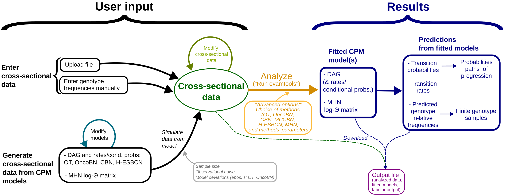
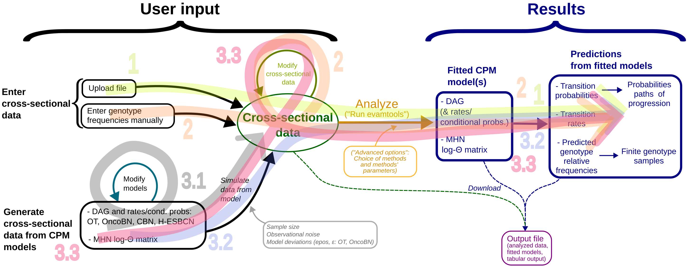

<center><h1>EvAM-Tools</h1></center>

&nbsp;
****
#### Table of contents <a id="evamtools"></a>
****
- [EvAM-Tools](#evamtools)
<br>&nbsp;&nbsp;- [A two-paragraph summary about cross-sectional data and CPMs](#helpcsd)
- [How to use this web interface?](#input)
<br>&nbsp;&nbsp;- [Web app: overview of workflow and functionality](#overview)
<br>&nbsp;&nbsp;- [```User input```](#userinput)
<br>&nbsp;&nbsp;- [Analyze data: ```Run evamtools```](#running)
<br>&nbsp;&nbsp;- [```Results```](#helpresults)
<br>&nbsp;&nbsp;- [Additional documentation](#additional_docs)
<br>&nbsp;&nbsp;- [Example files for upload](#example_files)
<br>&nbsp;&nbsp;- [Session timeouts, RAM and elapsed time execution limits](#limits)
<br>&nbsp;&nbsp;- [How long does it take to run?](#timetorun)
- [What CPMs are included in ```EvAM-Tools```?](#cpms)
<br>&nbsp;&nbsp;- [Default options and default CPMs run](#cpms2run)
<br>&nbsp;&nbsp;- [References and related repositories](#refs)
- [Where is the code? Terms of use? Copyright](#code)
<br>&nbsp;&nbsp;- [Authors, contact and bug reports](#authors) 
- [Funding](#funding)
- [Cookies](#cookies)


****
## EvAM-Tools <a id="evamtools"></a>
****

```EvAM-Tools``` is an R package and Shiny web app that provides tools for evolutionary accumulation, or event accumulation, models. We use code from  "Cancer Progression Models" (CPM) but these are not limited to cancer (the key idea is that events are gained one by one, but not lost). ```EvAM-Tools``` is  also available as an R package (see https://github.com/rdiaz02/EvAM-Tools).


This web interface provides a GUI to the package and focuses on allowing fast construction, manipulation, and exploration of CPM models, and making it easy to gain an intuitive understanding of what these methods infer from different data sets as well as what kind of data are to be expected under these models. You can analyze your data, create cross-sectional data from scratch (by giving genotype frequencies), or generate synthetic data under different CPMs. You can compare results from different methods/models, as well as experiment and understand the consequences of changes in the input data on the returned inferences. You can also examine how a given method performs when data have been generated under another (or its own) model. Additional examples of use are discussed in  https://github.com/rdiaz02/EvAM-Tools#some-examples-of-use and in the ["EvAM-Tools: examples" additional documentation file](https://rdiaz02.github.io/EvAM-Tools/pdfs/evamtools_examples.pdf).

<!-- * In the ```User input``` tab (on top of the page) you can upload data or define cross-sectional data, or simulate cross-sectional data from models. These are then submitted to run. -->
<!-- * In the ```Results``` tab you can see the output. -->

<!-- You add/remove images by adding HTML code. The usual img block. But do not leave that commented code around or shiny might break. -->


&nbsp;
### A two-paragraph summary about _cross-sectional_ data and CPMs<a id="helpcsd"></a> 
***

In cross-sectional data a single sample is obtained from each subject or patient. That single sample represents the "observed genotype" of, for example, the tumor of that patient. Genotype can refer to single point mutations, insertions, deletions, or any other genetic modification. In this app, as is often done by CPM software, we store cross-sectional data in a matrix, where rows are patients or subjects, and columns are genes; the data is a 1 if the event was observed and 0 if it was not.

Cancer progression models (CPMs) or, more generally, event accumulation models, use these cross-sectional data to try to infer restrictions in the order of accumulation of events; for example, that a mutation on gene B is always preceded by a mutation in gene A (maybe because mutating B when A is not mutated). Some cancer progression models, such as MHN, instead of modeling deterministic restrictions, model facilitating/inhibiting interactions between genes, for example that having a mutation in gene A makes it very likely to gain a mutation in gene B. A longer explanation is provided in [What CPMs are included in ```EvAM-Tools```?](#cpms), below, and many more details in  [EvAM-Tools: methods' details and FAQ](https://rdiaz02.github.io/EvAM-Tools/pdfs/evamtools_methods_details_faq.pdf ).  Finally, note we have talked about  "genotype" and "mutation", but CPMs have been used with non-genetic data too, and thus our preference for the expression "event accumulation models"; as said above, the key idea is that events are gained one by one, but not lost, and that we can consider the different subjects/patients in the cross-sectional data as replicate evolutionary experiments or runs where all individuals are under the same constraints (e.g., genetic constraints if we are dealing with mutations).


&nbsp;&nbsp;

****
## How to use this web interface? <a id="input"></a>
***


****
### Web app: overview of workflow and functionality<a id="overview"></a>
***


The figure below provides an overview of the major workflows with the web app:

<br>

<br>
<br>


The web app encompasses, thus, different major functionalities and workflows, mainly:


1. Inference of CPMs from user data uploaded from a file.

2. Exploration of the inferences that different CPM methods yield from manually constructed synthetic data.

3. Construction of CPM models (DAGs with their rates/probabilities and MHN models) and simulation of synthetic data from them. 

    3.1. Examination of the consequences of different CPM models and their parameters on the simulated data. 

    3.2. Analysis of data simulated under one model with methods that have different models (e.g., data simulated from CBN analyzed with OT and OncoBN).
	
	3.3. Analysis of data simulated under one model with manual modification of specific genotype frequencies prior to analyses (e.g., data simulated under CBN but where, prior to analysis, we remove all observations with the WT genotype and the genotype with all loci mutated).


Furthermore, note that in all cases, when data are analyzed, in addition to returning the fitted models, the web app also returns the analysis of the CPMs in terms of their predictions such as predicted genotype frequencies and transition probabilities between genotypes.


The figure below highlights the different major functionalities and workflows, as numbered above, over-imposed on the previous figure:


<br>

<br>
<br>


We explain now in more detail the functionality, options, input, and output, of the web app. Commented examples that illustrate each of those workflows are provided in the [EvAM-Tools: examples](https://rdiaz02.github.io/EvAM-Tools/pdfs/evamtools_examples.pdf).

&nbsp;&nbsp;
****
### ```User input```<a id="userinput"></a>
***


To start using the web app, go first to the ```User input``` tab (on top of the page). Here you can:
    &nbsp;
   - Enter cross-sectional data directly by either:
       - Uploading a file.
       - Entering genotype frequencies manually<br/>
        		&nbsp;
   - Generate cross-sectional data from CPM models. Follow these steps:
       1. Specify the CPM model first. You can use:
	   
	       1.1. Models that use DAGs to specify restrictions: OT, OncoBN (in both its conjunctive and disjunctive versions), CBN and H-ESBCN (H-ESBCN allows you to model AND, OR, and XOR dependency relationships). You will specify the DAG and the rates (CBN, H-ESBCN)/conditional probabilities (OT, OncoBN) of events conditional on their parents.<br/>

		   1.2. MHN, that models inhibiting/facilitating relationships between genes using baseline hazard rates and multiplicative effects between genes (specified in the log-&Theta; matrix).
		   &nbsp;
	   2. Simulate data from the CPM model. In addition to the number of samples, you can specify the amount of observational noise (and, for OT and OncoBN, deviations from the model).<br/>
	   &nbsp;

           Note that simulating data from CPMs allows you to get an intuitive feeling for what different CPM models and their parameters mean in terms of the genotype frequency data they produce.
	   
	   
&nbsp;
&nbsp;

Cross-sectional data that have been uploaded or simulated from CPM models can be further modified by altering genotype counts. Moreover, it is possible to specify cross-sectional data and DAG/MHN models with user-specified gene names. Finally, from the "User input" tab you can also save the cross-sectional data.


To make it easier to play with the tool, we provide predefined cross-sectional data sets under "Enter genotype frequencies manually", as well as predefined DAG and MHN models (from which you can generate data by clicking on "Generate data from DAG [MHN model]"). You can also modify the predefined DAGs and MHNs before generating data.


&nbsp;&nbsp;

****
### Analyze data: ```Run evamtools```<a id="running"></a>
***

1. Change, if you want, the options under "Advanced options and CPMs to use" (on the right of the screen). These options include what CPM methods to use as well as parameters of the methods.
2. Click on "Run evamtools". 
3.  Results will be shown in the ```Results``` tab.


<!-- * Go first to the ```User input``` tab (on top of the page). Here you can: -->
<!--     - Define your data by specifying the genotype composition or uploading a data set or a combination of both. -->
<!--     - Generate data according to CPM models specified using DAGs (Directed Acyclic Graphs) and trees: CBN, OT, OncoBN, H-ESBCN: "DAG and rates/probs". -->
<!--     - Generate data according to the MHN model: "MHN thetas". -->
<!--     - When you generate data according to a model, you can specify the sample size, the amount of noise, if any, to add, and the parameters of the models. -->
<!--     - You can also increase or decrease the number of genes, or rename genes. -->

<!-- * Change, if you want, options under "Advanced options and CPMs to use" (on the right of the screen). -->
<!-- * Click on "Run evamtools".  -->
<!-- * Results will be shown in the ```Results``` tab. -->


&nbsp;&nbsp;

****
###  ```Results```<a id="helpresults"></a>
***

The results include:
 &nbsp;
  * The fitted CPMs themselves, including the DAGs with their rates/conditional probabilities (depending on the model) and the MHN log-&Theta; matrix.
	 &nbsp;
	 
  * Predictions derived from the fitted models, including:
	&nbsp;
    * Transition probabilities: conditional probability of transition to a genotype (obtained using competing exponentials from the transition rate matrix for all methods except OT and OncoBN). For OT and OncoBN this is actually an abuse of the untimed oncogenetic tree model; see the [Evamtools: methods' details and FAQ](https://rdiaz02.github.io/EvAM-Tools/pdfs/evamtools_methods_details_faq.pdf) for details.

    * Transition rates: for models that provide them (CBN, H-ESBCN, MHN) transition rates of the continuous-time Markov chain that models the transition from one genotype to another. This option is not available for OT and OncoBN, as these do not return rates.

	* Predicted genotype relative frequencies: the predicted genotype frequencies from the fitted models. 

	* Sampled genotype counts: Counts, or absolute genotype frequencies obtained by generating a finite sample (of the size you chose) with the probabilities given by the predicted genotype frequencies. If you add noise, the sampled genotype counts include observational (e.g., genotyping) noise.
	
  <!-- * Observed genotype transitions (counts): if you choose to *Sample for observed genotype transitions* (under ```Advanced options and CPMs to use```), for models that return a transition rate matrix (CBN, H-ESBCN, MHN), we obtain the observed sampled of genotypes by simulating sampling from the continuous-time Markov chain; this provides also observed transition counts between genotypes. -->
	<!-- See remove_note_sogt_1 -->	
	
&nbsp;	
	
The results are displayed using a combination of figures and tabular output. Specifically:

  * The first row of figures shows the fitted CPMs: DAGs with their rates/probabilities and MHN log-&Theta; matrix.
	
     * The edges of the DAGs are annotated with the lambda (CBN, HESBCN),  weight (OT) or &theta; (OncoBN).
		 
     * Remember: for DAGs, these are DAGs that have *genes (not genotypes) as nodes*. They represent the order restrictions of the events.
	 
     * For MHN there is no DAG of restrictions; we show the fitted log-&Theta; matrix rounded to two decimal places. The diagonal entries are the log-baseline rates, and the off-diagonal the log of the multiplicative effects of the effector event (the columns) on the affected event (rows).
		 
	 * You can represent the results of all the fitted models or only of a subset (select those using "CPMs to show").
&nbsp;&nbsp;&nbsp;&nbsp;

  * The second row of figures shows the predictions derived from the fitted models. These same predictions are also displayed in tabular output on the bottom right. On the left side panel ("Customize the visualization"), you choose what predictions you want to display.
&nbsp;&nbsp;

  * The plots that show Transition probabilities and Transition rates (again, on the second row of figures) have *genotypes (not genes) as nodes*.
    * You can show, for these transition plots, only some of the most relevant paths; again, modify options under "Customize the visualization".
    * These plots might include genotypes never observed in the sample; these are shown in light green.
    * For easier visualization, in very busy plots, instead of the Genotypes you might want to show the last gene (or event) mutated or gained; change this options under "Type of label".


To help interpret the results, we also show a histogram of the genotype counts of the analyzed data.


Finally, you can also *download* the tabular results, fitted models, and the analyzed data. To download figures, either use screen captures or use your web browser to download them (e.g., right click on a figure to obtain a menu with a "Save image as" entry ---if you need higher resolution or original PDF images, you will need to use the R package itself).


&nbsp;&nbsp;
***
### Additional documentation<a id="additional_docs"></a>
***

Additional documents are available from https://rdiaz02.github.io/EvAM-Tools .

For users of the web app, the most relevant are: [EvAM-Tools: examples](https://rdiaz02.github.io/EvAM-Tools/pdfs/evamtools_examples.pdf) and [EvAM-Tools: methods' details and FAQ](https://rdiaz02.github.io/EvAM-Tools/pdfs/evamtools_methods_details_faq.pdf).


<!-- (If you install the R package or the RStudio Docker image with the package, you also have access to the documentation of the package, which is included in this pdf). -->


&nbsp;&nbsp;
***
### Example files for upload <a id="example_files"></a>
***

In https://github.com/rdiaz02/EvAM-Tools/tree/main/examples_for_upload there are several files in CSV format ready to be used as examples for upload. The two files mentioned in the documentation are: [ov2.csv](https://raw.githubusercontent.com/rdiaz02/EvAM-Tools/main/examples_for_upload/ov2.csv) and [BRCA_ba_s.csv](https://raw.githubusercontent.com/rdiaz02/EvAM-Tools/main/examples_for_upload/BRCA_ba_s.csv).

&nbsp;&nbsp;

****
### Session timeouts, RAM and elapsed time execution limits<a id="limits"></a>
***

Inactive connections will timeout after 2 hours. The page will become gray, and if you refresh (e.g., F5 in most browsers) after this time, you will not get back your results, figures, etc, but start another session. 

Maximum RAM of any process is limited to 2 GB. Likewise, the analyses should be aborted after 1.5 hours of elapsed (not CPU ---we parallelize the runs) time. If you want to use the Shiny app without these limits, install a local copy. (To modify the time limit, change the value of variable EVAM_MAX_ELAPSED, in the definition of function "server", in file "server.R".  The RAM limit is imposed on the Docker containers we use; to remove it, run Docker without the memory limit.) Note: because of what we do to enforce these limits, running over limits might not be signalled by an explicit error, but rather by a graying out or a complete refresh of the session.


&nbsp;&nbsp;

****
### How long does it take to run? <a id="timetorun"></a>
***

It depends on the number of genes or features and methods used. For six genes, and if you do not use H-ESBCN nor MC-CBN, it should take about 20 seconds. If you do not use CBN either (i.e., if you only use MHN, OT, and OncoBN) it should run in less than 8 seconds. Model fitting itself is parallelized, but other parts of the program cannot be (e.g., displaying the final figures).

&nbsp;&nbsp;


****
## What CPMs are included in ```EvAM-Tools```?<a id="cpms"></a>
***

*  **Oncogenetic Trees (OT):** Restrictions in the accumulation of mutations (or events) are represented as a tree. Hence, a parent node can have many children, but children have a single parent. OTs are untimed (edge weights represent conditional probabilities of observing a given mutation, when the sample is taken, given the parents are observed).

*  **Conjuntive Bayesian Networks (CBN):** This model generalizes the tree-based restriction of OT to a directed acyclic graph (DAG). A node can have multiple parents, and it denotes that all of the parents have to be present for the children to appear. Therefore, relationships are conjuntive (AND relationships between the parents). These are timed models, and the parameters of the models are rates given that all parents have been observed. We include both H-CBN as well as MC-CBN.

*  **Hidden Extended Suppes-Bayes Causal Networks (H-ESBCN):** Somewhat similar to CBN, but it includes automatic detection of logical formulas AND, OR, and XOR. H-ESBCN is used by its authors as part of Progression Models of Cancer Evolution (PMCE). Like CBN, it returns rates.
  
*  **OncoBN**: Similar to OT, in the sense of being an untimed oncogenetic model, but allows both AND (the conjunctive or CBN model) and OR relationships (the disjunctive or DBN model).

  
*  **Mutual Hazard networks (MHN):** With MHN dependencies are not deterministic and events can make other events more like or less likely (inhibiting influence). The fitted parameters are multiplicative hazards that represent how one event influences other events.


For details, please see the [EvAM-Tools: methods' details and FAQ](https://rdiaz02.github.io/EvAM-Tools/pdfs/evamtools_methods_details_faq.pdf).

&nbsp;

****
### Default options and default CPMs run<a id="cpms2run"></a>
***

- In the Shiny app, by default we run CBN, OT, OncoBN, and MHN. If you want to run H-ESBCN or MC-CBN, or not run some of the above methods, (de)select them under ```Advanced options and CPMs to use```. (H-ESBCN or MC-CBN are not run by default, as they can take a long time).
- OncoBN can be run using a conjunctive or a disjunctive model. The default used in the Shiny app (and the ```evam``` function in the package) is the disjunctive model. You can use the conjunctive one by selecting it under ```Advanced options and CPMs to use```, in ```OncoBN options```, ```Model```.
- Most methods have other options that can be modified. Again, check ```Advanced options and CPMs to use```.


****
### References and related repositories<a id="refs"></a>
***

##### OT ####


- Desper, R., Jiang, F., Kallioniemi, O. P., Moch, H., Papadimitriou, C. H., &
  Sch\"affer, A A (1999). Inferring tree models for oncogenesis from comparative
  genome hybridization data. J Comput Biol, 6(1), 37–51.

- Szabo, A., & Boucher, K. M. (2008). Oncogenetic Trees. In W. Tan, & L. Hanin
  (Eds.), Handbook of Cancer Models with Applications (pp. 1–24). : World
  Scientific.

- Oncotree R package: https://CRAN.R-project.org/package=Oncotree

&nbsp;

##### H-CBN and MC-CBN ####

- Beerenwinkel, N., & Sullivant, S. (2009). Markov models for accumulating
  mutations. Biometrika, 96(3), 645.

- Gerstung, M., Baudis, M., Moch, H., & Beerenwinkel, N. (2009). Quantifying
  cancer progression with conjunctive Bayesian networks. Bioinformatics, 25(21),
  2809–2815. http://dx.doi.org/10.1093/bioinformatics/btp505


- Gerstung, M., Eriksson, N., Lin, J., Vogelstein, B., & Beerenwinkel, N. (2011). The Temporal Order of Genetic and Pathway Alterations in Tumorigenesis. PLoS ONE, 6(11), 27136. http://dx.doi.org/10.1371/journal.pone.0027136 

- Montazeri, H., Kuipers, J., Kouyos, R., B\"oni, J\"urg, Yerly, S., Klimkait, T., Aubert, V., … (2016). Large-scale inference of conjunctive Bayesian networks. Bioinformatics, 32(17), 727–735. http://dx.doi.org/10.1093/bioinformatics/btw459 
  
- GitHub repository for MC-CBN: https://github.com/cbg-ethz/MC-CBN

- Source code for h/ct-cbn:  https://bsse.ethz.ch/cbg/software/ct-cbn.html


&nbsp;

##### MHN ####


- Schill, R., Solbrig, S., Wettig, T., & Spang, R. (2020). Modelling cancer progression using Mutual Hazard Networks. Bioinformatics, 36(1), 241–249. http://dx.doi.org/10.1093/bioinformatics/btz513 

- GitHub repository: https://github.com/RudiSchill/MHN  

&nbsp;

##### H-ESBCN (PMCE) ####


- Angaroni, F., Chen, K., Damiani, C., Caravagna, G., Graudenzi, A., & Ramazzotti, D. (2021). PMCE: efficient inference of expressive models of cancer evolution with high prognostic power. Bioinformatics, 38(3), 754–762. http://dx.doi.org/10.1093/bioinformatics/btab717 


-  Repositories and terminology: we will often refer to H-ESBCN, as that is the program we use, as shown here: https://github.com/danro9685/HESBCN. H-ESBCN is part of the PMCE procedure: https://github.com/BIMIB-DISCo/PMCE.

&nbsp;

##### OncoBN (DBN) ####

- Nicol, P. B., Coombes, K. R., Deaver, C., Chkrebtii, O., Paul, S., Toland, A. E., & Asiaee, A. (2021). Oncogenetic network estimation with disjunctive Bayesian networks. Computational and Systems Oncology, 1(2), 1027. http://dx.doi.org/10.1002/cso2.1027 

- GitHub repository: https://github.com/phillipnicol/OncoBN

&nbsp;

##### Conditional prediction of genotypes and probabilities of paths from CPMs ####

- Hosseini, S., Diaz-Uriarte, R., Markowetz, F., & Beerenwinkel, N. (2019). Estimating the predictability of cancer evolution. Bioinformatics, 35(14), 389–397. http://dx.doi.org/10.1093/bioinformatics/btz332 

- Diaz-Uriarte, R., & Vasallo, C. (2019). Every which way? On predicting tumor evolution using cancer progression models. PLOS Computational Biology, 15(8), 1007246. http://dx.doi.org/10.1371/journal.pcbi.1007246 

- Diaz-Colunga, J., & Diaz-Uriarte, R. (2021). Conditional prediction of consecutive tumor evolution using cancer progression models: What genotype comes next? PLOS Computational Biology, 17(12), 1009055. http://dx.doi.org/10.1371/journal.pcbi.1009055 

&nbsp;


****
## Where is the code? Terms of use? Copyright<a id="code"></a>
***

The complete source code for the package and the shiny app, as well information about how to run the shiny app locally, is available from https://github.com/rdiaz02/EvAM-Tools.


This app is free to use. Confidentiality and security: ff you have confidential data, you might want not to upload it here, and instead install the package locally. 


&nbsp;
### Authors, contact and bug reports<a id="authors"></a>

Most of the files for this app (and the package) are copyright Ramon Diaz-Uriarte and Pablo Herrera-Nieto (and released under the Affero GPL v3 license ---https://www.gnu.org/licenses/agpl-3.0.html) except some files for HESBCN, MHN, and the CBN code; see full details in https://github.com/rdiaz02/EvAM-Tools#copyright-and-origin-of-files.


For bug reports, please, submit them using the repository https://github.com/rdiaz02/EvAM-Tools.

&nbsp;
****
## Funding<a id="funding"></a>
***

Supported by grant PID2019-111256RB-I00 funded by MCIN/AEI/10.13039/501100011033 and Comunidad de Madrid's PEJ-2019-AI/BMD-13961 to R. Diaz-Uriarte.
<center>

</center>

&nbsp;
****
## Cookies<a id="cookies"></a>
***
We use cookies to keep "sticky sessions" to the pool of servers (load balanced using [HAproxy](https://www.haproxy.org/)). By using the app, you confirm you are OK with this.


