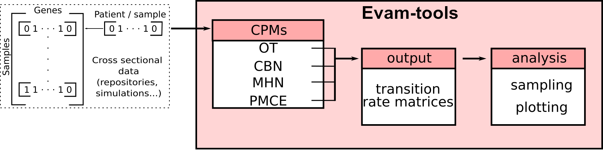
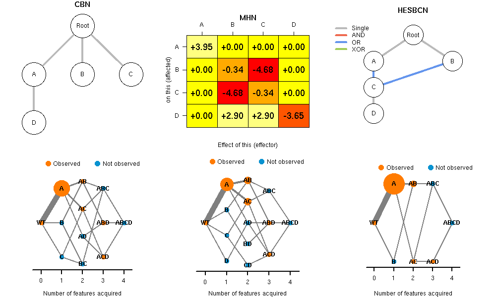

# What is Evam-tools?
***

```Evam-tools``` is an R package and Shiny app that provides tools for evolutionary accumulation, or event accumulation, models. We use code from what are usually referred to as "Cancer Progression Models" (CPM) but these are not limited to cancer (the key idea is that events are gained one by one, but not lost). ```Evam-tools``` is is also available as an R package (see https://github.com/rdiaz02/EvAM-Tools).


<!-- that allows to infer cancer evolutionary pathways  from [_cross sectional data **(CSD)**_](#helpcsd) base on the output of [_cancer progression models  **(CPMs)**_](#cpms). -->


<!-- ```Evam-tools``` is a package that allows to infer cancer evolutionary pathways  from [_cross sectional data **(CSD)**_](#helpcsd) base on the output of [_cancer progression models  **(CPMs)**_](#cpms). -->

This web interface provides a user-friendly interactive version of the package. You can analyze your own data, create cross-section data from scratch (by giving genotype frequencies) or generate data under different CPMs.
<!-- Here you can define complex scenarios with a few click and check the predictions of several models. -->

* In the ```User input``` tab (on top of the page) you can upload data or define cross-sectional data, or simulate cross-sectional data from models. These are then submitted to run and ...
* in the ```Results``` tab you can see the output.

<!-- FIXME: you add/remove images doing blablabla -->

<center>

</center>

## What is _cross-sectional_ data?<a id="helpcsd"></a> 
***

In cross-sectional data, a single sample has been taken from each patient. That single sample represents the "observed genotype" of the tumor of that patient.
Genotype can refer to single point mutations, insertions, deletions or any other genetic modification. In this app, as is often done by CPM software, we store cross-sectional data in a matrix, where rows are patients or subjects and columns are genes, and the data are  _0_ if an event is not observed in a patient, or with _1_ if it is observed.


&nbsp;&nbsp;

# How to use this web interface? <a id="input"></a>
***


* Go first to the ```User input``` tab (on top of the page). Here you can:
    - Define your data either by specifying the genotype composition or uploading a data set or a combination of both.
    - Generate data according to CPM models specified using DAGs and trees: CBN, OT, OncoBN, H-ESBCN: "DAG and rates/probs".
    - Generate data according to the MHN model: "MHN thetas".
    - When you generate data according to a model, you can specify the sample size, the amount of noise, if any, to add, and of course the parameters of the models.
    - You can also increase or decrease the number of genes, or rename genes.

* Change, if you want, the "Advanced options" (on the right of the screen).
* Click on "Run evamtools". 
* Results will be shown in the ```Results``` tab.


To make it easier to play with the tool, under "DAG and rates/probs" there are several predefined DAGs from which you can generate data or modify before generating data.


<!-- The first step is to **define an scenario**. -->
<!-- You can do it by going to the ```User Input``` tab in the navigation bar at the top. -->

<!-- This web interface allows to define _CSD_ in three different ways: -->

<!-- * _By directly **defining genotypes frequencies**_ : you directly define what mutations are observed in how many patients. -->
<!-- * _By deriving genotype frequencies from a **direct acyclic graph (DAG)**_ : here you define dependency relationships between genes. -->
<!-- * _By deriving genotype frequencies from a **transition rate matrix**_ : the transition rate matrix reflects how genes affects each other, by making them more likely to mutate (positive theta) or less likely (negative theta). -->

<!-- Once you have created an scenario or selected one, you can hit the ```Run evamtools!``` button. -->
<!-- This will run several [_CPMs_](#cpms) and will display their [results](#helpresults).  -->

You can also increase or decrease the number of genes, or rename genes.

&nbsp;&nbsp;

<!-- # How to build an scenario of cancer evolutions that makes some sense? A simple example <a id="examples"></a> -->
<!-- *** -->
<!-- Image a simple scenarios where only study 3 genes (A, B ,and C).  -->

<!-- We sample 12 patients and we observe the following: -->
<!-- <center> -->

<!-- |            | A | B | C | -->
<!-- |:----------:|:-:|:-:|:-:| -->
<!-- | Patient  1 | 1 | 0 | 0 | -->
<!-- | Patient  2 | 1 | 0 | 0 | -->
<!-- | Patient  3 | 1 | 0 | 0 | -->
<!-- | Patient  4 | 1 | 0 | 0 | -->
<!-- | Patient  5 | 1 | 1 | 0 | -->
<!-- | Patient  6 | 1 | 1 | 0 | -->
<!-- | Patient  7 | 1 | 1 | 0 | -->
<!-- | Patient  8 | 1 | 1 | 0 | -->
<!-- | Patient  9 | 1 | 1 | 1 | -->
<!-- | Patient  10 | 1 | 1 | 1 | -->
<!-- | Patient  11 | 1 | 1 | 1 | -->
<!-- | Patient  12 | 1 | 1 | 1 | -->

<!-- </center> -->

<!-- Gene _A_ appers alone. Gene _B_ **always** appears when gene _A_ is mutated. -->
<!-- Hence, we can infeer thats the likelihood gene _B_ mutating is increased if gene _A_ is also mutated. -->
<!-- The same happens for gene _C_, it is only mutated if both genes _A_ and _B_ are also mutated. -->

<!-- In this example, we sample 16 patients and we observe the following: -->

<!-- <center> -->

<!-- |            | A | B | C | -->
<!-- |------------|---|---|---| -->
<!-- | Patient  1 | 1 | 0 | 0 | -->
<!-- | Patient  2 | 1 | 0 | 0 | -->
<!-- | Patient  3 | 1 | 0 | 0 | -->
<!-- | Patient  4 | 1 | 0 | 0 | -->
<!-- | Patient  5 | 0 | 1 | 0 | -->
<!-- | Patient  6 | 0 | 1 | 0 | -->
<!-- | Patient  7 | 0 | 1 | 0 | -->
<!-- | Patient  8 | 0 | 1 | 0 | -->
<!-- | Patient  9 | 1 | 1 | 0 | -->
<!-- | Patient  10 | 1 | 1 | 0 | -->
<!-- | Patient  11 | 1 | 1 | 0 | -->
<!-- | Patient  12 | 1 | 1 | 0 | -->
<!-- | Patient  13 | 1 | 1 | 1 | -->
<!-- | Patient  14 | 1 | 1 | 1 | -->
<!-- | Patient  15 | 1 | 1 | 1 | -->
<!-- | Patient  16 | 1 | 1 | 1 | -->

<!-- </center> -->

<!-- Genes _A_ and _B_ appears mutated either in combination or isolated.  -->
<!-- In principle, there is not a dependency relationship between those two -->

<!-- However, gene _C_ only appears mutated if _A_ and _B_ are also mutated. -->
<!-- We can infeer dependecy relationship: -->

<!-- >booth _A_ **AND** _B_ has to be mutated for mutation in gene _C_ to appear. -->

<!-- &nbsp;&nbsp; -->


## What is available under "Results"?<a id="helpresults"></a>
***


<!-- # How to interpret the ```Results```?<a id="helpresults"></a> -->
<!-- *** -->

The results include:

* Plots:
    * On the top row, the DAGs and, for MHN, the log-&Theta; matrix.
        * The edges of the DAGs are annotated with the lambda (CBN, HESBCN),  weight (OT) or &theta; (OncoBN).
        * Remember: these are DAGs that have *genes (not genotypes) as nodes*. They represent the order restrictions of the events.
    * On the bottom row, the transition probabilities between genotypes or the transition rate matrix (for the models that return it); what is represented is chosen on the left, ```Customize the visualization```.
        * These plots have *genotypes (not genes) as nodes*.
        * (If you choose to *Sample for observed genotype transitions*, under  ```Advanced options```, for models that return a transition rate matrix (CBN, H-ESBCN, MHN), you can also represent the observed genotype transitions.)
        * You can show, for the bottom plots, only some of the most relevant paths; again, modify options under ```Customize the visualization```.
        * The bottom plots might include genotypes never observed in the sample; this are shown in light green.
        * For easier visualization, in very busy plots, instead of the Genotypes you might want to show the last gene mutated.
    * You can represent only a subset of the fitted models (choose the CPMs to show). 

&nbsp;	
* Tabular output: a table where you can choose to display:
    * Transition probabilities: the probabilities of transition between genotypes. For OT and OncoBN see the additional documentation as these are not really available for untimed oncogenetic models.
    * Transition rates: for models that provide them (CBN, H-ESBCN, MHN) transition rates.
    * Predicted genotype relative frequencies: the predicted genotype frequencies from the fitted models.
    * Sampled genotype counts: the counts from obtaining a finite sample (of the size you chose) with the probabilities given by the predicted genotype frequencies. If you add noise, they include observational (e.g., genotyping) noise.
    * Observed genotype transitions (counts): if you choose to *Sample for observed genotype transitions* (under  ```Advanced options```), for models that return a transition rate matrix (CBN, H-ESBCN, MHN) we obtain the observe sampled of genotypes by simulating sampling from the continuous time Markov chain; this provides also observed transition counts between genotypes.
	
	
&nbsp;		
* Original data: to help interpret the results, a histogram of the genotype counts is also provided.

You can also *download* the tabular results, fitted models, and the analyzed data.


<!--     2.  -->


<!-- 1. *Plotting the model*: here you can see either the **DAG** of each CPM showing the infered dependency relationships or the **transition rate matrix** in the case some [_CPMs_](#cpms). -->
<!-- 1. *Plotting the sampling*: this plot is a bit more complex. It represents the flow that we have sampled using the output of its [_CPM_](#cpms). It highlights the most relevant genotypes and transitions between genotypes. It is created by making random samples using the parameters from the [_CPM_](#cpms) and counting the transitions observed and counting the transitions observed (defining edge width) and the genotype frequency (node size).   -->

<center>

</center>


<!-- ## Minimal glossary<a id="glossary"></a> -->
<!-- *** -->


## Additional documentation<a id="additional_docs"></a>
***

Additional documentation is available from the R package itself (you would need to install the package or download one of the Docker images and run it from there) and the PDF  https://github.com/rdiaz02/EvAM-Tools/Additional_doc.pdf.

<!-- FIXME! Make sure we generate the above pdf. Concatenate the help files and the current SupplementaryInfo.tex. -->


<!-- 3. *Tabular data*: represents the raw values computed from the model or extracted from the samples. This includes:  -->
  
<!--   * *Transition rates*: the transition rate matrix of the continuous time Markov chain that models the transition from one genotype to another. This option is not available for OT, as OT does not return rates. -->
<!--   * *Transition probabilities*: conditional probability of transitions to a genotype (obtained using competing exponentials from the transition rate matrix; for OT this is actually a abuse of the untimed oncogenetic tree model, as explained in Diaz-Uriarte & Vasallo, 2019). -->
<!--   * *Genotype frequencies*: absolute frequencies of each genotype as obtained by sampling from the given model. For all models except OT, obtained by simulating a sampling process from the transition rate matrix with observation time distributed as an exponential of rate 1. For OT, obtained from the code of Szabo & Boucher (package Oncotree) that gives the predicted probabilities of the genotypes according to the OT model; we then use multinomial sampling from the predicted probabilities.  -->


<!--   * *Genotype transitions counts*: the number of times a transition from genotype A to genotype B has been observed when sampling. This option is not available for OT as this is undefined for OT. or DBN. -->

<!--   * *Lambdas/probabilities*: parameters of each model. This option is not available for MHN, that returns hazards. -->
<!--   * *Time-discretized transition matrix*:  the time-discretized version of the transition rate matrix. This option is not available for OT (as it requires rates). -->


&nbsp;&nbsp;

<!-- # What is a cancer progression model (CPM)?<a id="cpms"></a> -->
<!-- *** -->

<!-- Cancer progression models use cross-sectional data to infer probabilistic relationships between mutational events that lead to the disease.  -->

<!-- &nbsp;&nbsp; -->

# What CPMs are included in ```Evam-tools```?<a id="cpms"></a>
***

*  **Oncogenetic Tress (OT):** this is the simplest graphical model. Restrictions are represented as a tree. Hence, a parent node can have many children, but children have a single parent.
*  **Conjuntive Bayesian Networks (CBN):** this model generalizes the tree-based restricion of OT to a direct acyclic graph (DAG). A DAG allows to include multiple parents. In CBN, when a node depends of many parent events, all of the them have to be present for the children to appear. In that sense, CBN models this relationships as conjuntive, in other words, it models the AND relationship.
*  **Hidden Extended Suppes-Bayes Causal Networks (H-ESBCN):** is somewhat similar to CBN, but it includes automatic detection of logical formulas AND, OR and XOR. Note: H-ESBCN is used by its authors as part of Progression Models of Cancer Evolution (PMCE).
    
*  **Mutual Hazard networks (MHN):** in this model dpeendencies are not deterministic and events can make other events  more like or less likely (inhibiting influence**. Hence, MHN includes multiple dependencies and is not limited to DAG schemes. The main parameters is a theta matrix of multiplicative hazards that represents how one event influences other events.


# Where is the code? Terms of use? Copyright
***

 The complete source code for the package and the shiny app, as well information about how to run the shiny app locally, is available from https://github.com/rdiaz02/EvAM-Tools.


This app is free to use (if you have confidential data, you might want not to upload it here, and instead install the package locally). 


Most of the files for this app (and the package) are copyright Pablo Herrera Nieto and Ramon Diaz-Uriarte (and released under the GPL v3 license) except some files for HESBCN, MHN, and the CBN code; see full details in https://github.com/rdiaz02/EvAM-Tools#copyright-and-origin-of-files.

