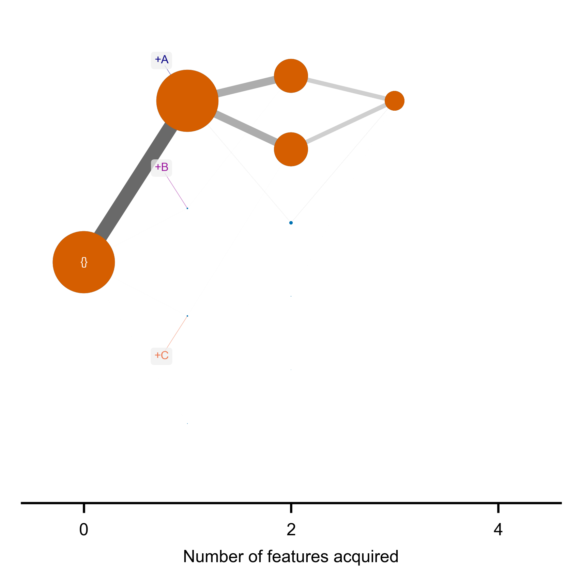

En el plot de la derecha, la franja azul el walk simulator 1 (WS1): que busca ir desde 0 mutaciones a todo mutado. El naranja es el WS2, que busca solo busca dentro de los genotipos observados. PREGUNTA: Esto último es lo más útil para nuestros datos, no? 
```r
pwd0 <- getwd()
setwd("../code_from_what_genotype_next/")
source("hypertraps-process.R")
setwd(pwd0)
rm(pwd0)

dB_AND <- matrix(
  c(
    rep(c(1, 0, 0, 0), 100)
    , rep(c(1, 1, 0, 0), 100)
    , rep(c(1, 1, 1, 0), 100)
    , rep(c(1, 1, 1, 1), 100)
    , rep(c(0, 0, 0), 10)
  ), ncol = 4, byrow = TRUE
)
colnames(dB_AND) <- LETTERS[1:4]

do_HyperTraPS(dB_AND, "HP_AND", runs = 500, bi=200)
```


<div style="page-break-after: always;"></div>

```r
dB_OR <- matrix(
  c(
    rep(c(1, 0, 0, 0), 200)
    , rep(c(1, 0, 1, 0), 100)
    , rep(c(1, 1, 0, 0), 100)
    , rep(c(1, 1, 1, 0), 50)
    , rep(c(1, 1, 0, 1), 50)
    , rep(c(1, 0, 1, 1), 50)
    , rep(c(1, 1, 1, 1), 10)
    , rep(c(0, 0, 0, 0), 10)
  ), ncol = 4, byrow = TRUE
)
colnames(dB_OR) <- LETTERS[1:4]

do_HyperTraPS(dB_OR, "HP_OR", runs = 500, bi=200)
```


<div style="page-break-after: always;"></div>

```r
dB_XOR <- matrix(
  c(
    rep(c(1, 0, 0, 0), 200)
    , rep(c(1, 1, 0, 0), 100)
    , rep(c(1, 0, 1, 0), 100)
    , rep(c(1, 1, 0, 1), 50)
    , rep(c(1, 0, 1, 1), 50)
    , rep(c(0, 0, 0, 0), 10)
  ), ncol = 4, byrow = TRUE
)
colnames(dB_XOR) <- LETTERS[1:4]

do_HyperTraPS(dB_XOR, "HP_XOR", runs = 500, bi=200)
```

